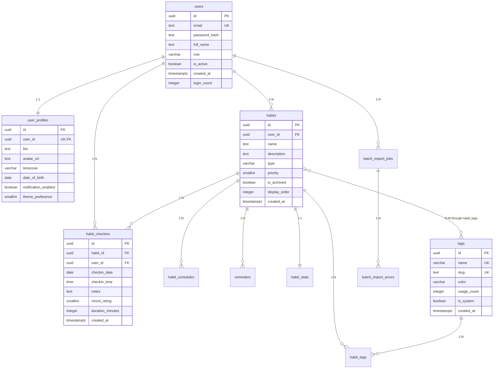

# Схема базы данных

## Общая информация

- **СУБД**: PostgreSQL 16
- **ORM**: Prisma
- **Количество таблиц**: 13
- **Требование**: каждая таблица >= 5 **РАЗНЫХ** типов данных

---

## Типы данных PostgreSQL

В проекте используются следующие типы данных:

1. **UUID** — уникальные идентификаторы
2. **TEXT** — текстовые данные неограниченной длины
3. **VARCHAR(N)** — текстовые данные с ограничением
4. **CHAR(N)** — текстовые данные фиксированной длины
5. **INTEGER** — целые числа (4 байта)
6. **BIGINT** — большие целые числа (8 байт)
7. **SMALLINT** — малые целые числа (2 байта)
8. **NUMERIC(p,s)** — числа с фиксированной точностью
9. **BOOLEAN** — булевы значения
10. **DATE** — дата без времени
11. **TIME** — время без даты
12. **TIMESTAMPTZ** — дата и время с часовым поясом
13. **JSONB** — бинарный JSON
14. **INET** — IP-адрес

---

## Таблицы

### 1. users — 8 колонок, 6 РАЗНЫХ типов ✓

**Назначение**: Основная таблица пользователей системы.

| Колонка | Тип | Ограничения | Описание |
|---------|-----|-------------|----------|
| id | UUID | PRIMARY KEY, DEFAULT gen_random_uuid() | Уникальный идентификатор |
| email | TEXT | UNIQUE, NOT NULL | Email пользователя |
| password_hash | TEXT | NOT NULL | Хеш пароля (bcrypt) |
| full_name | TEXT | NOT NULL | Полное имя |
| role | VARCHAR(50) | DEFAULT 'user' | Роль пользователя |
| is_active | BOOLEAN | DEFAULT true | Активен ли аккаунт |
| created_at | TIMESTAMPTZ | DEFAULT NOW() | Дата создания |
| login_count | INTEGER | DEFAULT 0 | Количество входов |

**Уникальные типы**: UUID, TEXT, VARCHAR, BOOLEAN, TIMESTAMPTZ, INTEGER = **6 типов** ✓

**Связи**:
- 1:1 → user_profiles
- 1:N → habits, habit_checkins, batch_import_jobs

---

### 2. user_profiles — 8 колонок, 6 РАЗНЫХ типов ✓

**Назначение**: Дополнительная информация о пользователе (связь 1:1 с users).

| Колонка | Тип | Ограничения | Описание |
|---------|-----|-------------|----------|
| id | UUID | PRIMARY KEY, DEFAULT gen_random_uuid() | Уникальный идентификатор |
| user_id | UUID | UNIQUE, NOT NULL, FK → users | Ссылка на пользователя |
| bio | TEXT | NULL | Биография |
| avatar_url | TEXT | NULL | URL аватара |
| timezone | VARCHAR(100) | DEFAULT 'UTC' | Часовой пояс |
| date_of_birth | DATE | NULL | Дата рождения |
| notification_enabled | BOOLEAN | DEFAULT true | Уведомления включены |
| theme_preference | SMALLINT | DEFAULT 0, CHECK (0-2) | Тема оформления |

**Уникальные типы**: UUID, TEXT, VARCHAR, DATE, BOOLEAN, SMALLINT = **6 типов** ✓

**Связи**:
- N:1 → users (ON DELETE CASCADE)

---

### 3. habits — 9 колонок, 7 РАЗНЫХ типов ✓

**Назначение**: Привычки пользователей (хорошие и плохие).

| Колонка | Тип | Ограничения | Описание |
|---------|-----|-------------|----------|
| id | UUID | PRIMARY KEY, DEFAULT gen_random_uuid() | Уникальный идентификатор |
| user_id | UUID | NOT NULL, FK → users | Владелец привычки |
| name | TEXT | NOT NULL | Название привычки |
| description | TEXT | NULL | Описание |
| type | VARCHAR(10) | NOT NULL, CHECK IN ('good', 'bad') | Тип привычки |
| priority | SMALLINT | DEFAULT 0, CHECK (0-10) | Приоритет |
| is_archived | BOOLEAN | DEFAULT false | Архивирована |
| display_order | INTEGER | DEFAULT 0 | Порядок отображения |
| created_at | TIMESTAMPTZ | DEFAULT NOW() | Дата создания |

**Уникальные типы**: UUID, TEXT, VARCHAR, SMALLINT, BOOLEAN, INTEGER, TIMESTAMPTZ = **7 типов** ✓

**Связи**:
- N:1 → users (ON DELETE CASCADE)
- 1:N → habit_schedules, habit_checkins, habit_tags, reminders
- 1:1 → habit_stats

---

### 4. habit_schedules — 8 колонок, 6 РАЗНЫХ типов ✓

**Назначение**: Расписания для привычек (ежедневные, еженедельные и т.д.).

| Колонка | Тип | Ограничения | Описание |
|---------|-----|-------------|----------|
| id | UUID | PRIMARY KEY | Уникальный идентификатор |
| habit_id | UUID | NOT NULL, FK → habits | Ссылка на привычку |
| frequency_type | VARCHAR(20) | CHECK IN (...) | Тип частоты |
| frequency_value | INTEGER | DEFAULT 1, CHECK > 0 | Значение частоты |
| weekdays_mask | SMALLINT | DEFAULT 127 | Битовая маска дней недели |
| start_date | DATE | NOT NULL | Дата начала |
| end_date | DATE | NULL | Дата окончания |
| is_active | BOOLEAN | DEFAULT true | Активно |

**Уникальные типы**: UUID, VARCHAR, INTEGER, SMALLINT, DATE, BOOLEAN = **6 типов** ✓

**Связи**:
- N:1 → habits (ON DELETE CASCADE)

---

### 5. habit_checkins — 9 колонок, 7 РАЗНЫХ типов ✓

**Назначение**: Отметки выполнения привычек (ТРАНЗАКЦИОННАЯ таблица, 10000+ записей).

| Колонка | Тип | Ограничения | Описание |
|---------|-----|-------------|----------|
| id | UUID | PRIMARY KEY | Уникальный идентификатор |
| habit_id | UUID | NOT NULL, FK → habits | Ссылка на привычку |
| user_id | UUID | NOT NULL, FK → users | Ссылка на пользователя |
| checkin_date | DATE | NOT NULL | Дата отметки |
| checkin_time | TIME | DEFAULT CURRENT_TIME | Время отметки |
| notes | TEXT | NULL | Заметки |
| mood_rating | SMALLINT | CHECK (1-5) | Оценка настроения |
| duration_minutes | INTEGER | NULL | Длительность в минутах |
| created_at | TIMESTAMPTZ | DEFAULT NOW() | Дата создания |

**UNIQUE**: (habit_id, checkin_date)

**Уникальные типы**: UUID, DATE, TIME, TEXT, SMALLINT, INTEGER, TIMESTAMPTZ = **7 типов** ✓

**Связи**:
- N:1 → habits (ON DELETE CASCADE)
- N:1 → users (ON DELETE CASCADE)

---

### 6. tags — 7 колонок, 6 РАЗНЫХ типов ✓

**Назначение**: Теги для категоризации привычек.

| Колонка | Тип | Ограничения | Описание |
|---------|-----|-------------|----------|
| id | UUID | PRIMARY KEY | Уникальный идентификатор |
| name | VARCHAR(100) | UNIQUE, NOT NULL | Название тега |
| slug | TEXT | UNIQUE, NOT NULL | URL-friendly имя |
| color | VARCHAR(7) | DEFAULT '#gray' | Цвет |
| usage_count | INTEGER | DEFAULT 0 | Счётчик использований |
| is_system | BOOLEAN | DEFAULT false | Системный тег |
| created_at | TIMESTAMPTZ | DEFAULT NOW() | Дата создания |

**Уникальные типы**: UUID, VARCHAR, TEXT, INTEGER, BOOLEAN, TIMESTAMPTZ = **6 типов** ✓

**Связи**:
- 1:N → habit_tags

---

### 7. habit_tags — 7 колонок, 5 РАЗНЫХ типов ✓

**Назначение**: Связь N:M между привычками и тегами.

| Колонка | Тип | Ограничения | Описание |
|---------|-----|-------------|----------|
| id | UUID | PRIMARY KEY | Уникальный идентификатор |
| habit_id | UUID | NOT NULL, FK → habits | Ссылка на привычку |
| tag_id | UUID | NOT NULL, FK → tags | Ссылка на тег |
| priority | SMALLINT | DEFAULT 0 | Приоритет |
| is_primary | BOOLEAN | DEFAULT false | Основной тег |
| assigned_by | VARCHAR(50) | DEFAULT 'user' | Кто назначил |
| assigned_at | TIMESTAMPTZ | DEFAULT NOW() | Дата назначения |

**UNIQUE**: (habit_id, tag_id)

**Уникальные типы**: UUID, SMALLINT, BOOLEAN, VARCHAR, TIMESTAMPTZ = **5 типов** ✓

**Связи**:
- N:1 → habits (ON DELETE CASCADE)
- N:1 → tags (ON DELETE CASCADE)

---

### 8. reminders — 8 колонок, 7 РАЗНЫХ типов ✓

**Назначение**: Напоминания для привычек.

| Колонка | Тип | Ограничения | Описание |
|---------|-----|-------------|----------|
| id | UUID | PRIMARY KEY | Уникальный идентификатор |
| habit_id | UUID | NOT NULL, FK → habits | Ссылка на привычку |
| reminder_time | TIME | NOT NULL | Время напоминания |
| days_of_week | SMALLINT | DEFAULT 127 | Дни недели (битовая маска) |
| notification_text | TEXT | NULL | Текст уведомления |
| delivery_method | VARCHAR(20) | DEFAULT 'push', CHECK IN (...) | Метод доставки |
| is_active | BOOLEAN | DEFAULT true | Активно |
| created_at | TIMESTAMPTZ | DEFAULT NOW() | Дата создания |

**Уникальные типы**: UUID, TIME, SMALLINT, TEXT, VARCHAR, BOOLEAN, TIMESTAMPTZ = **7 типов** ✓

**Связи**:
- N:1 → habits (ON DELETE CASCADE)

---

### 9. habit_stats — 9 колонок, 5 РАЗНЫХ типов ✓

**Назначение**: Агрегированная статистика по привычкам (обновляется триггером).

| Колонка | Тип | Ограничения | Описание |
|---------|-----|-------------|----------|
| id | UUID | PRIMARY KEY | Уникальный идентификатор |
| habit_id | UUID | UNIQUE, NOT NULL, FK → habits | Ссылка на привычку |
| total_checkins | INTEGER | DEFAULT 0 | Всего отметок |
| current_streak | INTEGER | DEFAULT 0 | Текущая серия |
| longest_streak | INTEGER | DEFAULT 0 | Лучшая серия |
| completion_rate | NUMERIC(5,2) | DEFAULT 0.00 | Процент выполнения |
| average_mood | NUMERIC(3,2) | NULL | Средняя оценка настроения |
| last_checkin_at | DATE | NULL | Последняя отметка |
| updated_at | TIMESTAMPTZ | DEFAULT NOW() | Дата обновления |

**Уникальные типы**: UUID, INTEGER, NUMERIC, DATE, TIMESTAMPTZ = **5 типов** ✓

**Связи**:
- 1:1 → habits (ON DELETE CASCADE)

**Обновляется триггером**: `update_habit_stats()` при INSERT/UPDATE/DELETE в habit_checkins

---

### 10. audit_log — 9 колонок, 6 РАЗНЫХ типов ✓

**Назначение**: Журнал аудита изменений.

| Колонка | Тип | Ограничения | Описание |
|---------|-----|-------------|----------|
| id | UUID | PRIMARY KEY | Уникальный идентификатор |
| table_name | VARCHAR(100) | NOT NULL | Название таблицы |
| operation | VARCHAR(10) | NOT NULL, CHECK IN (...) | Тип операции |
| record_id | UUID | NULL | ID изменённой записи |
| user_id | UUID | NULL | ID пользователя |
| old_data | JSONB | NULL | Старые данные |
| new_data | JSONB | NULL | Новые данные |
| ip_address | INET | NULL | IP-адрес |
| changed_at | TIMESTAMPTZ | DEFAULT NOW() | Дата изменения |

**Индексы**:
- `idx_audit_log_changed_at` на (changed_at DESC)

**Уникальные типы**: UUID, VARCHAR, JSONB, INET, TIMESTAMPTZ = **5 типов** ✓

**Заполняется триггером**: `audit_trigger_fn()` на habits, habit_checkins, tags, reminders

---

### 11. _manual_migrations — 7 колонок, 6 РАЗНЫХ типов ✓

**Назначение**: Контроль применения SQL-миграций (триггеров, функций, VIEW, индексов).

| Колонка | Тип | Ограничения | Описание |
|---------|-----|-------------|----------|
| id | UUID | PRIMARY KEY | Уникальный идентификатор |
| name | VARCHAR(255) | UNIQUE, NOT NULL | Название миграции |
| checksum | CHAR(64) | NULL | SHA-256 hash |
| applied_at | TIMESTAMPTZ | DEFAULT NOW() | Дата применения |
| execution_time_ms | INTEGER | NULL | Время выполнения |
| status | VARCHAR(20) | DEFAULT 'success', CHECK IN (...) | Статус |
| applied_by | TEXT | NULL | Кто применил |

**Уникальные типы**: UUID, VARCHAR, CHAR, TIMESTAMPTZ, INTEGER, TEXT = **6 типов** ✓

---

### 12. batch_import_jobs — 11 колонок, 6 РАЗНЫХ типов ✓

**Назначение**: Задачи батчевого импорта данных.

| Колонка | Тип | Ограничения | Описание |
|---------|-----|-------------|----------|
| id | UUID | PRIMARY KEY | Уникальный идентификатор |
| user_id | UUID | FK → users, ON DELETE SET NULL | Пользователь |
| entity_type | VARCHAR(50) | NOT NULL | Тип сущности |
| status | VARCHAR(20) | CHECK IN (...) | Статус |
| total_records | INTEGER | DEFAULT 0 | Всего записей |
| success_count | INTEGER | DEFAULT 0 | Успешных |
| error_count | INTEGER | DEFAULT 0 | Ошибок |
| progress_percent | NUMERIC(5,2) | DEFAULT 0.00 | Прогресс |
| file_size_bytes | BIGINT | NULL | Размер файла |
| started_at | TIMESTAMPTZ | DEFAULT NOW() | Время начала |
| completed_at | TIMESTAMPTZ | NULL | Время завершения |

**Уникальные типы**: UUID, VARCHAR, INTEGER, NUMERIC, BIGINT, TIMESTAMPTZ = **6 типов** ✓

**Связи**:
- N:1 → users (ON DELETE SET NULL)
- 1:N → batch_import_errors

---

### 13. batch_import_errors — 7 колонок, 6 РАЗНЫХ типов ✓

**Назначение**: Ошибки батчевого импорта.

| Колонка | Тип | Ограничения | Описание |
|---------|-----|-------------|----------|
| id | UUID | PRIMARY KEY | Уникальный идентификатор |
| job_id | UUID | NOT NULL, FK → batch_import_jobs | Ссылка на задачу |
| row_number | INTEGER | NULL | Номер строки |
| record_data | JSONB | NOT NULL | Данные записи |
| error_message | TEXT | NOT NULL | Сообщение об ошибке |
| error_code | VARCHAR(50) | NULL | Код ошибки |
| created_at | TIMESTAMPTZ | DEFAULT NOW() | Дата создания |

**Уникальные типы**: UUID, INTEGER, JSONB, TEXT, VARCHAR, TIMESTAMPTZ = **6 типов** ✓

**Связи**:
- N:1 → batch_import_jobs (ON DELETE CASCADE)

---

## Связи между таблицами

### 1:1
- users ↔ user_profiles
- habits ↔ habit_stats

### 1:N
- users → habits
- users → habit_checkins
- users → batch_import_jobs
- habits → habit_schedules
- habits → habit_checkins
- habits → habit_tags
- habits → reminders
- tags → habit_tags
- batch_import_jobs → batch_import_errors

### N:M
- habits ↔ tags (через habit_tags)

---

## ER-диаграмма (Mermaid)

---

## Проверка соответствия требованиям

### ✅ Требование: >= 5 РАЗНЫХ типов в каждой таблице

| Таблица | Количество уникальных типов | Статус |
|---------|------------------------------|--------|
| users | 6 (UUID, TEXT, VARCHAR, BOOLEAN, TIMESTAMPTZ, INTEGER) | ✅ |
| user_profiles | 6 (UUID, TEXT, VARCHAR, DATE, BOOLEAN, SMALLINT) | ✅ |
| habits | 7 (UUID, TEXT, VARCHAR, SMALLINT, BOOLEAN, INTEGER, TIMESTAMPTZ) | ✅ |
| habit_schedules | 6 (UUID, VARCHAR, INTEGER, SMALLINT, DATE, BOOLEAN) | ✅ |
| habit_checkins | 7 (UUID, DATE, TIME, TEXT, SMALLINT, INTEGER, TIMESTAMPTZ) | ✅ |
| tags | 6 (UUID, VARCHAR, TEXT, INTEGER, BOOLEAN, TIMESTAMPTZ) | ✅ |
| habit_tags | 5 (UUID, SMALLINT, BOOLEAN, VARCHAR, TIMESTAMPTZ) | ✅ |
| reminders | 7 (UUID, TIME, SMALLINT, TEXT, VARCHAR, BOOLEAN, TIMESTAMPTZ) | ✅ |
| habit_stats | 5 (UUID, INTEGER, NUMERIC, DATE, TIMESTAMPTZ) | ✅ |
| audit_log | 5 (UUID, VARCHAR, JSONB, INET, TIMESTAMPTZ) | ✅ |
| _manual_migrations | 6 (UUID, VARCHAR, CHAR, TIMESTAMPTZ, INTEGER, TEXT) | ✅ |
| batch_import_jobs | 6 (UUID, VARCHAR, INTEGER, NUMERIC, BIGINT, TIMESTAMPTZ) | ✅ |
| batch_import_errors | 6 (UUID, INTEGER, JSONB, TEXT, VARCHAR, TIMESTAMPTZ) | ✅ |

**Итого: 13/13 таблиц соответствуют требованию** ✅

---

## SQL-объекты

### Триггеры

1. **audit_trigger_fn()** — функция аудита изменений
   - Таблицы: habits, habit_checkins, tags, reminders
   - Записывает в audit_log: operation, old_data, new_data, user_id

2. **update_habit_stats()** — функция обновления агрегатов
   - Таблица: habit_checkins
   - Обновляет habit_stats при INSERT/UPDATE/DELETE

### Функции

1. **calc_completion_rate(user_id, from_date, to_date) RETURNS NUMERIC**
   - Скалярная функция
   - Расчёт процента выполнения привычек

2. **report_user_habits(user_id, from_date, to_date) RETURNS TABLE(...)**
   - Табличная функция
   - Отчёт по привычкам пользователя

### Представления (VIEW)

1. **v_user_habit_summary** — сводка по привычкам пользователя
2. **v_daily_completion** — ежедневная статистика
3. **v_tag_usage** — использование тегов

### Индексы

1. `idx_habits_user_id` — habits(user_id) WHERE NOT is_archived
2. `idx_habit_checkins_habit_date` — habit_checkins(habit_id, checkin_date DESC)
3. `idx_habit_checkins_user_date` — habit_checkins(user_id, checkin_date DESC)
4. `idx_habit_checkins_date` — habit_checkins(checkin_date DESC)
5. `idx_audit_log_table_op_time` — audit_log(table_name, operation, changed_at DESC)
6. `idx_audit_log_user_time` — audit_log(user_id, changed_at DESC)
7. `idx_habit_tags_habit` — habit_tags(habit_id)
8. `idx_habit_tags_tag` — habit_tags(tag_id)
9. `idx_batch_jobs_user_status` — batch_import_jobs(user_id, status)
10. `idx_batch_errors_job` — batch_import_errors(job_id)
