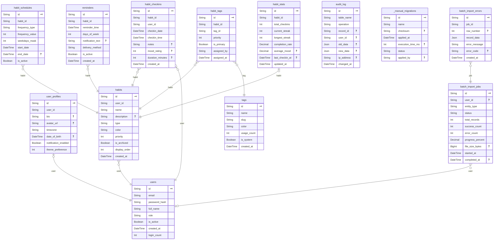

```mermaid
erDiagram

  "users" {
    String id "🗝️"
    String email 
    String password_hash 
    String full_name 
    String role 
    Boolean is_active 
    DateTime created_at 
    Int login_count 
    }
  

  "user_profiles" {
    String id "🗝️"
    String user_id 
    String bio "❓"
    String avatar_url "❓"
    String timezone 
    DateTime date_of_birth "❓"
    Boolean notification_enabled 
    Int theme_preference 
    }
  

  "habits" {
    String id "🗝️"
    String user_id 
    String name 
    String description "❓"
    String type 
    String color 
    Int priority 
    Boolean is_archived 
    Int display_order 
    DateTime created_at 
    }
  

  "habit_schedules" {
    String id "🗝️"
    String habit_id 
    String frequency_type 
    Int frequency_value 
    Int weekdays_mask 
    DateTime start_date 
    DateTime end_date "❓"
    Boolean is_active 
    }
  

  "habit_checkins" {
    String id "🗝️"
    String habit_id 
    String user_id 
    DateTime checkin_date 
    DateTime checkin_time 
    String notes "❓"
    Int mood_rating "❓"
    Int duration_minutes "❓"
    DateTime created_at 
    }
  

  "tags" {
    String id "🗝️"
    String name 
    String slug 
    String color 
    Int usage_count 
    Boolean is_system 
    DateTime created_at 
    }
  

  "habit_tags" {
    String id "🗝️"
    String habit_id 
    String tag_id 
    Int priority 
    Boolean is_primary 
    String assigned_by 
    DateTime assigned_at 
    }
  

  "reminders" {
    String id "🗝️"
    String habit_id 
    DateTime reminder_time 
    Int days_of_week 
    String notification_text "❓"
    String delivery_method 
    Boolean is_active 
    DateTime created_at 
    }
  

  "habit_stats" {
    String id "🗝️"
    String habit_id 
    Int total_checkins 
    Int current_streak 
    Int longest_streak 
    Decimal completion_rate 
    Decimal average_mood "❓"
    DateTime last_checkin_at "❓"
    DateTime updated_at 
    }
  

  "audit_log" {
    String id "🗝️"
    String table_name 
    String operation 
    String record_id "❓"
    String user_id "❓"
    Json old_data "❓"
    Json new_data "❓"
    String ip_address "❓"
    DateTime changed_at 
    }
  

  "_manual_migrations" {
    String id "🗝️"
    String name 
    String checksum "❓"
    DateTime applied_at 
    Int execution_time_ms "❓"
    String status 
    String applied_by "❓"
    }
  

  "batch_import_jobs" {
    String id "🗝️"
    String user_id "❓"
    String entity_type 
    String status 
    Int total_records 
    Int success_count 
    Int error_count 
    Decimal progress_percent 
    BigInt file_size_bytes "❓"
    DateTime started_at 
    DateTime completed_at "❓"
    }
  

  "batch_import_errors" {
    String id "🗝️"
    String job_id 
    Int row_number "❓"
    Json record_data 
    String error_message 
    String error_code "❓"
    DateTime created_at 
    }
  
    "user_profiles" |o--|| users : "user"
    "habits" }o--|| users : "user"
    "habit_schedules" }o--|| habits : "habit"
    "habit_checkins" }o--|| habits : "habit"
    "habit_checkins" }o--|| users : "user"
    "habit_tags" }o--|| habits : "habit"
    "habit_tags" }o--|| tags : "tag"
    "reminders" }o--|| habits : "habit"
    "habit_stats" |o--|| habits : "habit"
    "batch_import_jobs" }o--|o users : "user"
    "batch_import_errors" }o--|| batch_import_jobs : "job"
```
